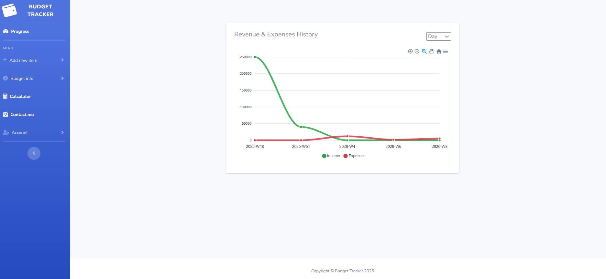
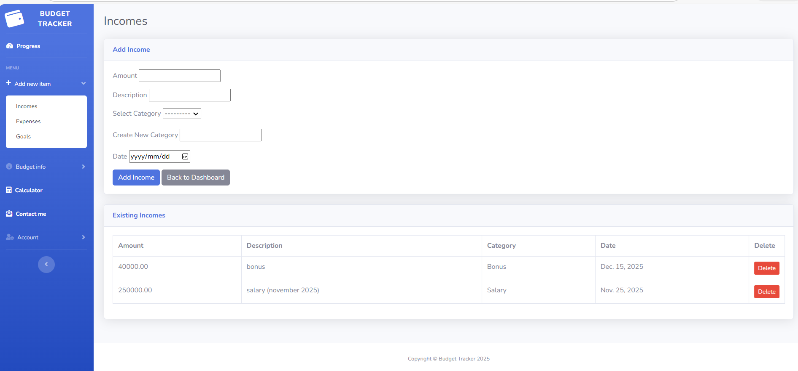
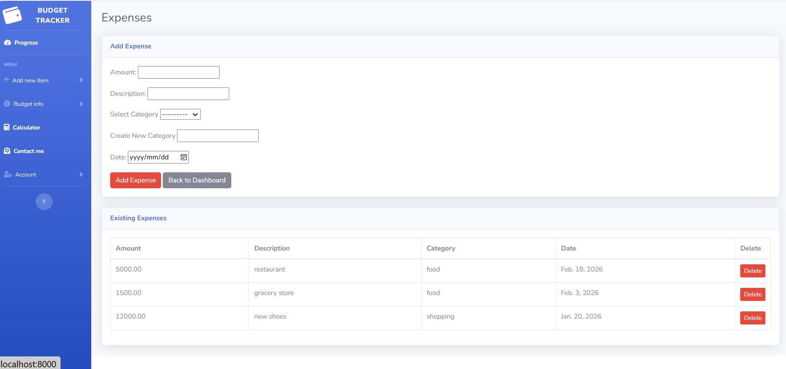

# 💰 Budget Tracker

## 📌 About
本プロジェクトは、個人向けの家計管理Webアプリです。  
収入・支出を登録して残高を可視化し、目標金額（貯金目標）を設定して達成状況（進捗）を追跡できます。  
日々の支出管理をシンプルに継続できることを目的としています。

---

## 🖥️ Demo / Screenshots
<p align="center">
  
  
</p>

<p align="center">
  
  
</p>

---

## ✨ Features

### 👤 ユーザー機能
- ✅ 収入・支出の登録（追加／編集／削除）
- ✅ 収支一覧の確認（履歴として管理）
- ✅ 目標金額（貯金目標など）の設定
- ✅ 目標の進捗（達成率）の可視化・確認
- ✅ ユーザーログイン／ログアウト（※実装している場合）

### 🛠️ 管理者機能（Admin）
- 🔐 管理者（Django Admin）としてログイン可能
- 🗂️ ユーザー／収入・支出／目標データの管理（CRUD）
- 🧹 データの監視・メンテナンス（不正データの修正など）

---

## 🧰 Tech Stack
- 🐍 Python  
- 🌐 Django  
- 🗃️ SQLite3  
- 🐳 Docker / Docker Compose  

---

## 🚀 Setup & Run

### ✅ 1) Clone
```bash
git clone https://github.com/Edgarchik-Tatarchik/BudgetTrackerOnDjango
cd BudgetTrackerOnDjango
cd BudgetTrackerPage
```
🐳 Option A: Run with Docker
```bash
docker compose up -d --build
```
アクセス: http://localhost:8000/
管理画面: http://localhost:8000/admin/

管理者ユーザー作成 (初回のみ)

```bash
docker compose exec web python manage.py createsuperuser
```
停止
```bash
docker compose down
```

💻 Option B: Run Locally（venv）
仮想環境作成 & 依存関係インストール
```bash
python -m venv .venv
```
# Windows: 
```bash
.venv\Scripts\activate
```
# mac/linux: 
```bash
source .venv/bin/activate
```

起動
```bash
pip install -r requirements.txt
python manage.py migrate
python manage.py runserver
``` 
アクセス: http://127.0.0.1:8000/


🧭 Usage
1) 収入・支出を追加する

左メニュー → Add new item を開く

Income（収入）または Expense（支出）を選択

カテゴリ（例：Salary / food / shopping）と金額を入力して保存する

2) ダッシュボードで統計を見る

Dashboard では以下を確認できます：

Incomes / Expenses：合計金額とカテゴリ別の内訳

グラフ表示、および目標（例：「New PC」）の進捗

新しいデータを追加すると、表示が自動的に更新されます

3) 目標を作成し、進捗を確認する

Progress を開く

目標（名称 + target）を作成する

円グラフで Progress / Remaining を確認する

4) その他のページ

Budget info：予算の概要／現在の金額（※実装されている場合）

Calculator：簡単な計算

Account：ユーザーとしてログイン／プロフィール（※実装されている場合）


🛠️ Admin（データ管理）

管理画面：/admin/

Django Admin からユーザー／収入・支出／目標データを管理できます


🗂️ Project Structure
```text
BudgetTrackerPage/
├─ budget_app/               # アプリ本体（収入・支出、目標管理などの機能）
├─ BudgetTrackerPage/        # Djangoプロジェクト設定（settings.py, urls.py など）
├─ staticfiles/              # collectstatic で出力される静的ファイル（本番想定）
├─ data/                     # SQLite DB（db.sqlite3）などの保存先
├─ templates/                # HTMLテンプレート（※存在する場合）
├─ manage.py                 # Djangoエントリーポイント
├─ requirements.txt          # Python依存関係
├─ Dockerfile                # Dockerイメージ定義
├─ docker-compose.yml        # Docker Compose 設定
├─ .dockerignore             # Docker用除外設定
└─ README.md                 # プロジェクト概要・手順
```

🔮 Future Improvements

🎯 目標管理の拡張（期限設定、複数目標、達成通知）

🐘 DBをSQLiteからPostgreSQLへ移行（本番運用を想定）

✅ テスト追加（unit/integration）とCI（GitHub Actions）導入


